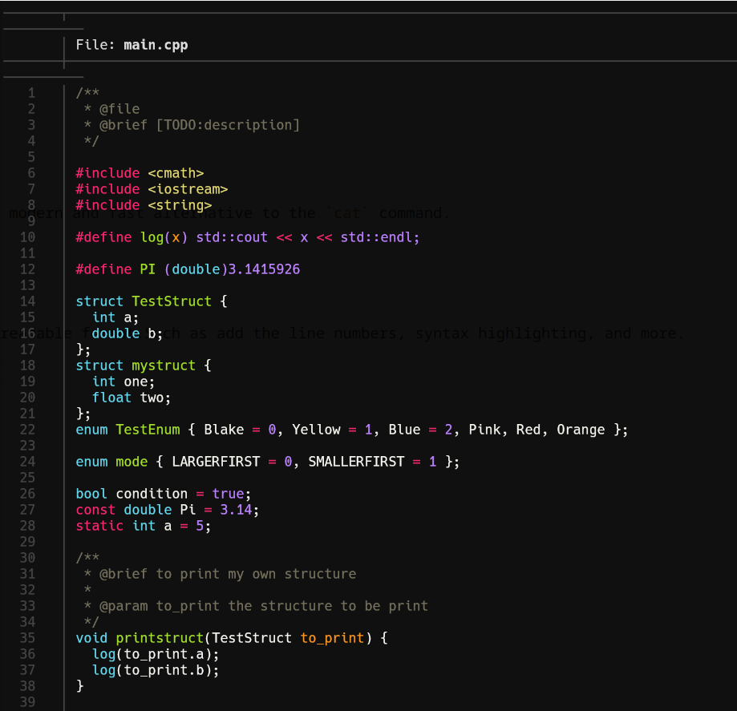
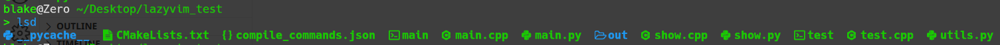
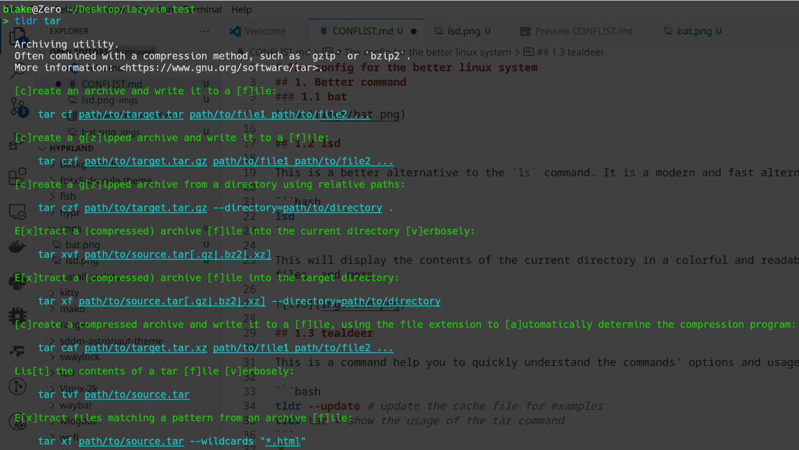
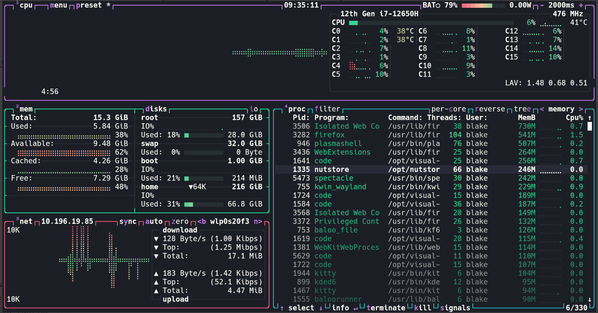
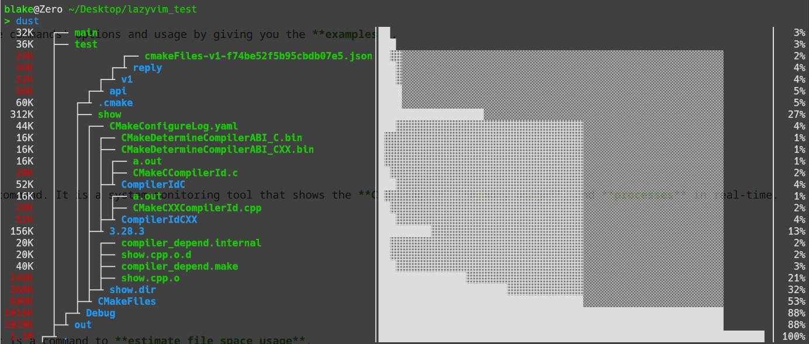
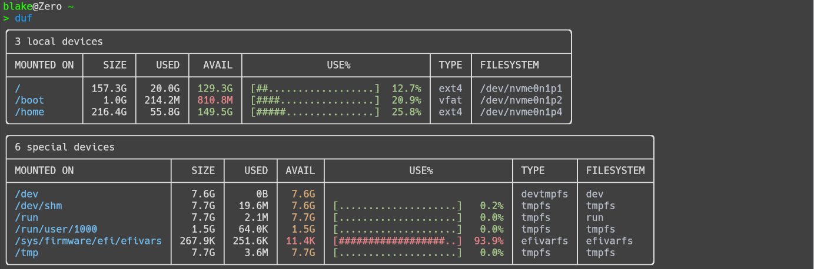
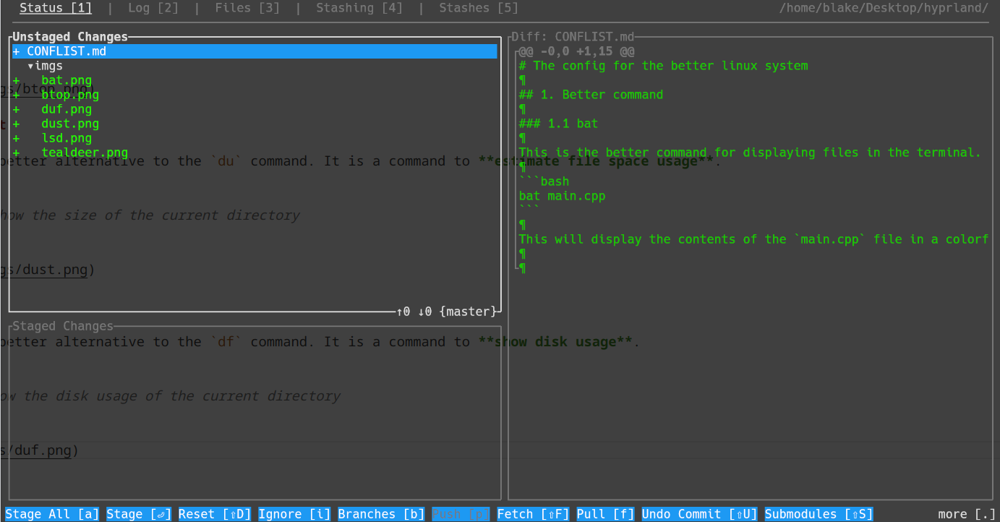
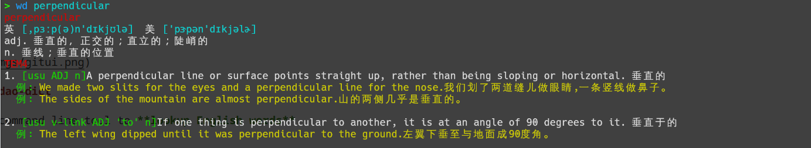
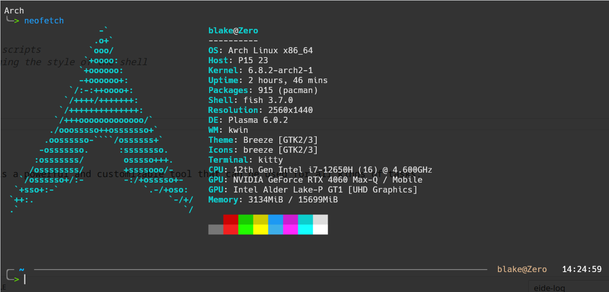

# The config for the better linux system

## 1. Better command

### 1.1 bat

This is the better command for displaying files in the terminal. It is a modern and fast alternative to the `cat` command.

```bash
bat main.cpp
```

This will display the contents of the `main.cpp` file in a colorful and readable format.Such as add the **line numbers**, **syntax highlighting**, and more. And you can also read it as a real document **rolling** it from the top, not as the cat command which just prints the contents of the file.



### 1.2 lsd

This is a better alternative to the `ls` command. It is a modern and fast alternative to the `ls` command.

```bash
lsd
```

This will display the contents of the current directory in a colorful and readable format. Such as add the **icons** for directories and files, show the **size** of the files, and more.



### 1.3 tealdeer

This is a command help you to quickly understand the commands' options and usage by giving you the **examples**.

```bash
tldr --update # update the cache file for examples
tldr tar # show the usage of the tar command
```



### 1.4 btop

This is a modern and fast alternative to the `top` command. It is a system monitoring tool that shows the **CPU usage**, **memory usage**, and **processes** in real-time.

```bash
btop
```



### 1.5 dust

This is a better alternative to the `du` command. It is a command to **estimate file space usage**.

```bash
dust . # show the size of the current directory
```



### 1.6 duf

This is a better alternative to the `df` command. It is a command to **show disk usage**.

```bash
duf . # show the disk usage of the current directory
```



### 1.7 gitui

This is a command line tool to **visualize git repositories**.

```bash
gitui
```



### 1.8 wudao-dict

This is a command line tool to **lookup English words**.

```bash
yay -S wudao-dict-git # install wudao-dict
wd perpendicular # lookup the word "perpendicular"
```



## 2. Better terminal

### 2.1 shell

#### 2.1.1 zsh

**Zsh** is a better shell than the default `bash`. It is a powerful and customizable shell that can be used for all kinds of tasks.

1. Install zsh

```bash
sudo pacman -S zsh
sudo apt install zsh
```

2. Change the default shell to zsh

```bash
chsh -s $(which zsh)
```

3. Install oh-my-zsh

```bash
sh -c "$(curl -fsSL https://raw.github.com/ohmyzsh/ohmyzsh/master/tools/install.sh)"
```

4. Install plugins

```bash
git clone https://github.com/zsh-users/zsh-autosuggestions ${ZSH_CUSTOM:-~/.oh-my-zsh/custom}/plugins/zsh-autosuggestions
git clone https://github.com/zsh-users/zsh-syntax-highlighting.git ${ZSH_CUSTOM:-~/.oh-my-zsh/custom}/plugins/zsh-syntax-highlighting
```

5. Set the themeimage   

```bash
sed -i's/ZSH_THEME="robbyrussell"/ZSH_THEME="agnoster"/' ~/.zshrc
```

6. Restart the terminal

#### 2.1.2 fish

**Fish** is also a better shell than the default `bash`. It is a powerful and customizable shell that can be used for all kinds of tasks.

1. Install fish

```bash
sudo pacman -S fish
sudo apt install fish
```

2. Change the default shell to fish

```bash
chsh -s $(which fish)
```

3. Install fisher and plugins

```bash
curl -sL https://raw.githubusercontent.com/jorgebucaran/fisher/main/functions/fisher.fish | source && fisher install jorgebucaran/fisher
# install fisher
# or you can use the following command to install fisher
sudo pacman -S fisher

# install plugins
fisher install junegunn/fzf
fisher install edc/bass # a userful tool for runing bash scripts
fisher install ilancosman/tide # a userful tool for managing the style of the shell
```

4. config the fish by tide

5. Restart the terminal



### 2.2 neovim

This is a better text editor than the default `vim`. It is a powerful and customizable tool that can be used for all kinds of tasks.

1. Install neovim

```bash
sudo apt install neovim
sudo pacman -S neovim
```

2. Install plugins and config the neovim

```bash
# install plugins from lazyvim
# required
mv ~/.config/nvim{,.bak}

# optional but recommended
mv ~/.local/share/nvim{,.bak}
mv ~/.local/state/nvim{,.bak}
mv ~/.cache/nvim{,.bak}

git clone https://github.com/LazyVim/starter ~/.config/nvim

rm -rf ~/.config/nvim/.git

nvim
```

3. Or you can config your own neovim by lazy.nvim

> there are other neovim version like lazyvim, lunarvim, astronvim, etc.

### 2.3 fzf

This is a better fuzzy finder than the default `Ctrl + P`. It is a powerful and customizable tool that can be used for all kinds of tasks.

```bash
sudo apt install fzf
sudo pacman -S fzf
```

1. Install fzf
2. Open fzf

```bash
fzf
```

3. Type the first few letters of the file or directory you want to find
4. Press `Enter` to select the file or directory