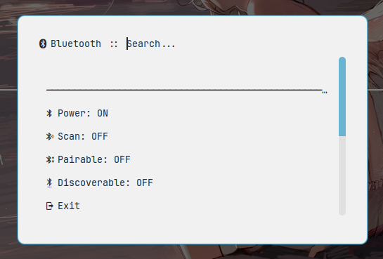

# Hyprland Settings
## 01 Contents

This is the repository storing the config files of hyprland settings **based on** [@SolDoesTech](https://github.com/SolDoesTech). It is made up of :

* `hypr` : the basic hyprland settings
* `waybar` : the waybar settings and the scripts
* `wlogout` : the wlogout settings and the icons
* `swaylock` : the swaylock settings
* `tofi` `wofi` : applications launcher
* `ranger` : the command line file manager
* `sddm-astronaut-theme` : the sddm theme from [@keyitdev](https://github.com/keyitdev/sddm-astronaut-theme.git)
* `fcitx5-dracula-theme` : the fcitx5 theme from [@drbbr](https://github.com/drbbr) 
* `kitty` : the terminal settings
* `mako` : the message settings
* `vscode-theme` : the vscode-theme based on the default theme which provides **the enhanced color support for C/C++**
* `gtk-3.0` `gtk-4.0` : the gtk theme setting
* `rofi` : the most powerful utils as AppLauncher, calculator, powermenu, network, bluetooth, todo, notes, screenshot, wallpaperSelect, thanks for [@Axenide](https://github.com/Axenide/Dotfiles) and [@adi1090x](https://github.com/adi1090x/rofi)
* `nvim` : the most powerful editor
* `swaync` : a notificator with a notification center
* `xsettingsd` : the x settings dir
* `neofetch` : the system catcher
* `wallpapers` : the wallpapers
* `fish` : the fish configuration
* `Vimix-2k` : the grub theme
* `.Xresources` : the dpi settings for x11 apps

## 02 Config

### 2.1 By Hand

Make sure 'the utils are installed' and Copy the config files to `~/.config` .

The most important packages are list in [Packages](./Packages.md) , you can refer to it for more details.

> The whole packages list can see -- [packages_list](./packages.lst) .

### 2.2 By scripts

You can config the hyprland by the scripts provided : 

```bash
./setup_hyprland.sh
```

## 03 Screenshot

### 3.1 Overview : 


### 3.2 Waybar : 


### 3.3 Workspaces overview : 


### 3.4 Ranger : 


### 3.5 Nvim : 


### 3.6 Notification Center : 


### 3.7 Lock Screen : 


### 3.8 Rofi Utils

#### 1. Applauncher : 


#### 2. Powermenu : 


#### 3. Caculator : 


#### 4. Screen Shoot Tool : 


#### 5. Todo : 


#### 6. Note : 


#### 7. Network : 


#### 8. Bluetooth : 



#### 9. Wallpaper Select


## 04 Usage

### 4.1 Applications

| Keybinds | Functions |
| --- | --- |
| `super + T` | open the terminal |
| `super + E` | open file manager |
| `super + A` | pick the color under cursor |
| `super + V` | open clipboard |
| `super + SPACE` | application launcher |
| `super + L` | lock the screen |
| `super + S` | area screen shot |
| `PRINT` | full screen shot |
| `super + ALT + S` | area screen shot and edit |
| `super + SHIFT + S` | open the scrennshot center |
| `super + SHIFT + M` | exit hyprland |
| `super + H` | toggle the status bar |
| `super + R` | refresh the utils |
| `super + N` | open the note list |
| `super + D` | open the todo list |
| `super + B` | open the bluetooth center |
| `super + SHIFT + N` | open the network center |
| `super + M` | open the calculator |
| `super + ESC` | open the power menu |
| `super + SHIFT + T` | select the wallpaper |

### 4.2 Windows and Workspaces

| Keybinds | Functions |
| --- | --- |
| `super + C` | close the window |
| `super + F` | toggle the window between float and maximum |
| `super + J` |	toggle the window between vertical or horizontal spilt |
| `F11` | toggle the window to be full screen |
| `super + SHIFT + Right` | move window to the right |
| `super + SHIFT + Left` | move window to the left |
| `super + SHIFT + Up` | move window to the up |
| `super + SHIFT + Down` | move window to the down |
| `super + Right` | move focus(cursor) to the right window |
| `super + Left` | move focus(cursor) to the left window |
| `super + Up` | move focus(cursor) to the up window |
| `super + Down` | move focus(cursor) to the down window |
| `super + Num` | switch to the workspace-n (Num is the number top) |
| `super + SHIFT + Num` | move the active window to workspace-n |
| `super + CTRL + Num` | move the active window to workspace-n silently |
| `super + W` | toggle the special workspace |
| `super + SHIFT + W` | move the active window to special workspace |
| `super + CTRL + W` | move the active window to special workspace  silently |
| `super + TAB` | switch to previous workspace |
